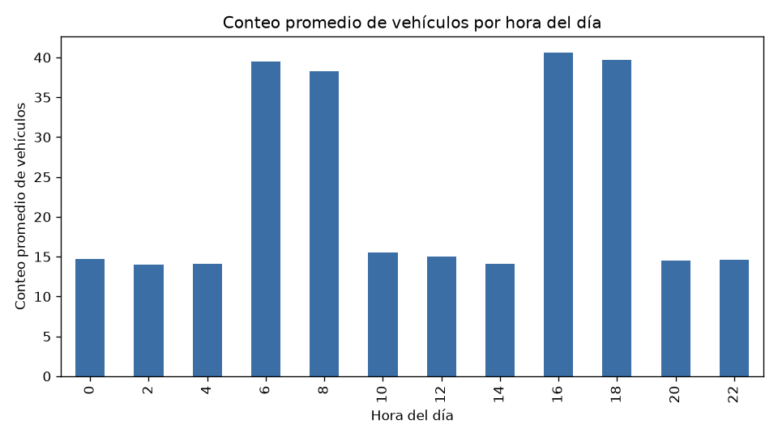
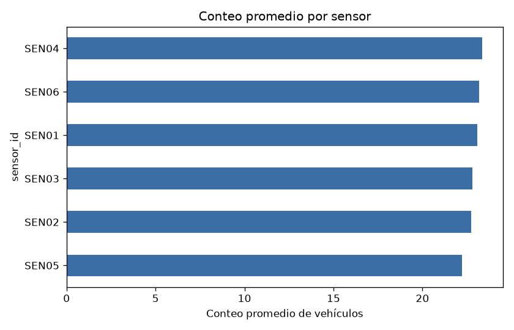
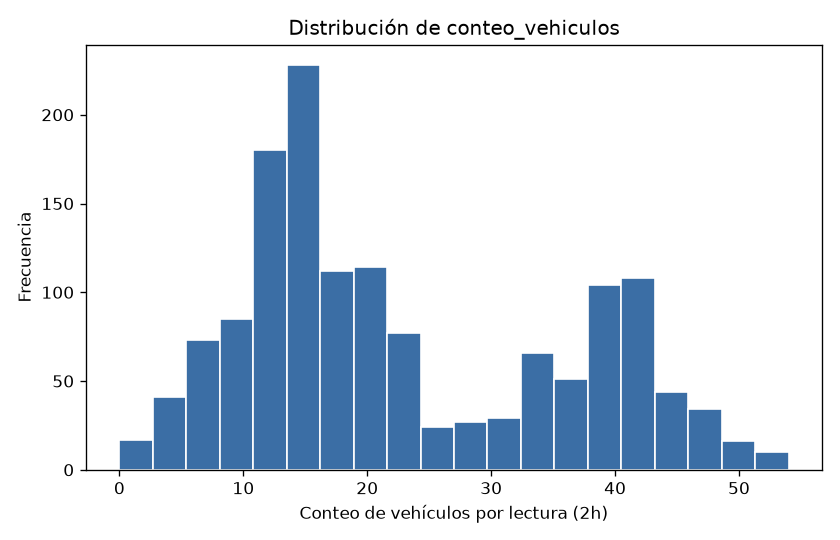
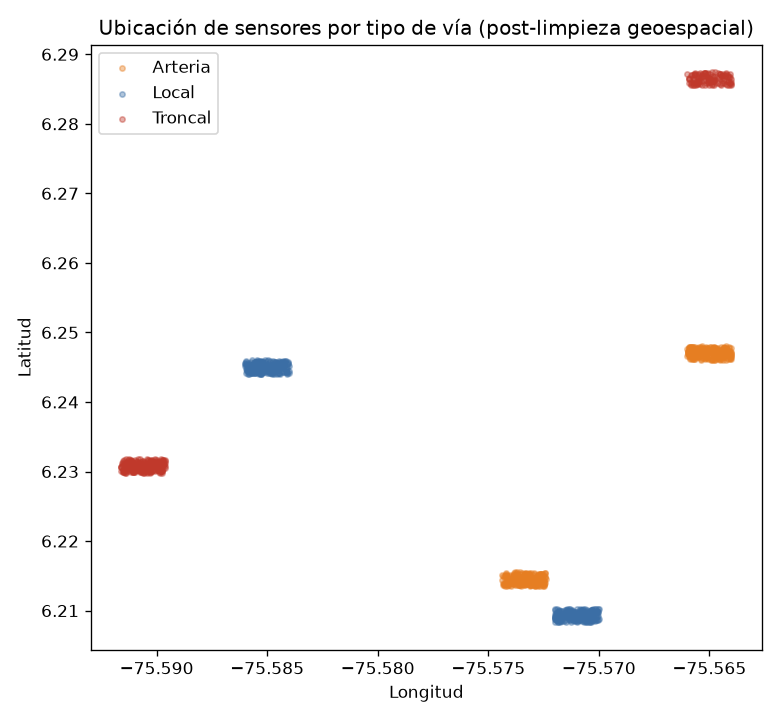

# Taller Práctico 01 — Movilidad urbana en Medellín

**Curso:** Fundamentos en Ciencia de Datos — Maestría en Ciencia de Datos y Analítica, EAFIT
**Conjunto de datos elegido:** C - Movilidad urbana
**Fecha límite de entrega:** domingo 26 de julio de 2026
**Fecha de entrega real:** [dd/mm/aaaa]

**Integrantes del equipo:**

| Nombre completo | Cédula         |
| ---------------- | -------------- |
| Santiago Alberto Velez Casallas | [N° de cédula] |
| Cristian Miguel Gomez Salazar   | [N° de cédula] |
| Santiago Rueda Mira             | [N° de cédula] |

---

## 1. Resumen ejecutivo

La Secretaría de Movilidad de Medellín quiere pilotear semaforización inteligente, pero tiene un
presupuesto limitado y necesita saber **dónde y cuándo** empezar. Tomamos 20 días de lecturas de 6
sensores de tráfico (cada 2 horas) y las cruzamos con un log de clima. El archivo llegó con errores
típicos de un proceso real: fechas en 5 formatos distintos, categorías de clima mal escritas,
lecturas duplicadas, conteos imposibles (negativos o de 99.999 vehículos) y un sensor con
coordenadas invertidas fuera de Medellín. Después de limpiarlo, la evidencia es clara: **el tráfico
casi se triplica en dos franjas horarias (6-8 a.m. y 4-6 p.m.) sin importar el tipo de vía ni el
corredor específico** — la variable que realmente importa es la hora, no el lugar. Recomendamos
iniciar el piloto en los 6 corredores por igual, concentrado en esas dos franjas, en vez de elegir
un solo tipo de vía como prioridad (los datos no lo sustentan).

## 2. Pregunta de negocio

- **Pregunta ancla del conjunto de datos:** ¿En qué corredores y horarios se debe pilotear
  semaforización inteligente?
- **Pregunta específica que el equipo decidió responder:** ¿cuál es la probabilidad de que un
  corredor supere un umbral de congestión ("Alto") en una franja horaria específica, sin importar su
  tipo de vía?

## 3. El viaje de los datos: de crudo a confiable

### 3.1 Lo que encontramos al abrir el archivo contaminado

Antes de analizar nada, diagnosticamos la calidad del archivo `movilidad_sensores_CONTAMINADO.csv`
(1455 filas) sin corregirlo todavía. Encontramos 7 problemas distintos:

| Problema | Columna(s) | Cómo lo detectamos | Por qué es un riesgo de negocio |
|---|---|---|---|
| Valores faltantes | `conteo_vehiculos` (145), `temperatura_c` (72), `condicion_clima` (87) | `isnull().sum()` | Subestiman el tráfico/clima real de esas franjas |
| Duplicados exactos de fila | todas | `duplicated().sum()` → 7 pares | Inflan el conteo total en ese corredor/hora |
| Duplicados de "evento de negocio" | `sensor_id` + `timestamp` | `duplicated(subset=[...], keep=False)` | Un mismo instante con valores contradictorios sesga el promedio por hora |
| Categorías de clima inconsistentes | `condicion_clima` | `unique()` → 12 variantes de solo 3 categorías | Subestima la categoría real; distorsiona tablas clima–tráfico |
| Fechas en 5 formatos mixtos | `timestamp` | Regex + conteo de fallos de `to_datetime(errors="coerce")` | Un parseo ingenuo asigna fechas *incorrectas* en vez de nulas |
| Valores imposibles | `conteo_vehiculos` | Negativos y el centinela `99999` | Distorsionan brutalmente cualquier promedio (std pasa de ~10 a 5518) |
| Coordenadas invertidas | `lat`, `lon` (sensor SEN04, 121 filas) | Regla de rango válido de Medellín | Un mapa ubicaría el sensor fuera de la ciudad, invalidando el análisis geoespacial |

*(Tabla completa con la estrategia de corrección de cada uno: [`results/tabla_diagnostico_gigo.csv`](results/tabla_diagnostico_gigo.csv))*

### 3.2 Cómo lo arreglamos (y por qué)

- **Fechas:** escribimos un parser que reconoce los 5 formatos explícitamente (en vez de dejar que
  pandas asuma el formato de EE. UU. y convierta `04/03/2025` en "4 de abril" por error) → 0% de
  fallos.
- **Clima:** unificamos mayúsculas y sinónimos (`Sol`→`Soleado`, `Nubes`→`Nublado`,
  `lluvioso`→`Lluvia`); los nulos los dejamos como categoría explícita `"Sin dato"` en vez de
  inventar con la moda.
- **Conteo de vehículos:** tratamos como inválido todo lo que fuera negativo o mayor a 500 (cubre el
  centinela `99999` sin descartar picos reales), e imputamos con la **mediana del mismo sensor a esa
  misma hora del día** — no la media global, para no aplanar los picos de tráfico reales.
- **Coordenadas:** en vez de "voltear" automáticamente lat/lon del sensor SEN04, las reemplazamos por
  la mediana histórica de coordenadas válidas de ese mismo sensor (un sensor físico no se mueve de
  lugar), dejando registro explícito en la columna `geo_corregida`.
- **Duplicados:** usamos `sensor_id` + `timestamp` como llave de negocio (cada sensor reporta una
  lectura por franja de 2 horas) y nos quedamos con la fila más completa por llave.

**Verificación:** aunque nunca usamos el archivo `_LIMPIO.csv` como referencia durante la limpieza,
al final lo comparamos solo para control de calidad — nuestras coordenadas corregidas de SEN04
(6.2864, -75.5650) coinciden casi exactamente con las del archivo limpio (6.2864, -75.5650), y el
conteo/temperatura promedio quedaron a menos de 0.1 de diferencia.

## 4. Lo que dicen los datos ya limpios

### 4.1 El patrón horario domina todo



El tráfico pasa de ~14 vehículos/lectura en horas valle a ~40 en hora pico — casi el triple. Los
picos (6-8h y 16-18h) coinciden con la entrada y salida laboral/escolar típica de Medellín.

### 4.2 Ni el tipo de vía ni el sensor explican la diferencia

| Tipo de vía | N lecturas | Conteo prom. |
|---|---|---|
| Troncal | 480 | 23.2 |
| Local   | 480 | 23.0 |
| Arteria | 480 | 22.5 |



La tabla por tipo de vía ya es casi plana (22.5–23.2); el detalle por sensor individual **confirma**
esa lectura en vez de matizarla (rango 22.2–23.4 entre los 6 sensores). Es un hallazgo honesto aunque
no sea el más "vistoso": la ubicación casi no discrimina, la hora sí.

### 4.3 El conteo de vehículos está sesgado, no es una campana simétrica



| Estadístico | `conteo_vehiculos` | `temperatura_c` |
|---|---|---|
| Media | 22.9 | 23.1 °C |
| Mediana | 18.0 | 23.1 °C |
| Desv. estándar | 13.0 | 2.8 °C |
| Mínimo | 0 | 14.4 °C |
| Máximo | 54 | 31.9 °C |

Media (22.9) y mediana (18.0) del conteo difieren notablemente — confirma la asimetría (muchas
lecturas bajas de madrugada, pocas muy altas en pico) y justifica usar mediana/IQR en vez de
media/desviación estándar para este caso. La temperatura, en cambio, es simétrica y se resume bien
con la media.

### 4.4 El clima no es (por ahora) un factor decisivo

| Condición climática | % lecturas | % en nivel de tráfico "Alto" |
|---|---|---|
| Soleado  | 49.1% | 34.7% |
| Nublado  | 30.4% | 29.1% |
| Lluvia   | 14.6% | 35.7% |
| Sin dato | 6.0%  | 37.2% |

La proporción de tráfico "Alto" es parecida entre Soleado, Nublado y Lluvia — en este período de 20
días el clima registrado no parece mover la aguja tanto como la hora del día. Lo dejamos como
variable a seguir monitoreando (ver limitaciones), no como palanca de decisión.

### 4.5 Los 6 sensores, ya en su lugar correcto



Tras corregir la georreferenciación, los 6 sensores quedan dentro del área urbana de Medellín (antes,
SEN04 aparecía fuera del continente por la inversión de coordenadas).

## 5. Decisión recomendada

- **Pregunta real que responde el análisis:** no "¿cuánto tráfico hay en promedio por tipo de vía?"
  (esa pregunta casi no discrimina), sino **¿cuál es la probabilidad de que un corredor supere un
  nivel de congestión "Alto" en una franja horaria específica?**
- **Recomendación:** iniciar el piloto de semaforización inteligente en **los 6 corredores por
  igual, concentrado en las franjas 6:00-8:00 y 16:00-18:00** — no en un solo tipo de vía, porque los
  datos no sustentan esa priorización. Si el presupuesto no alcanza para los 6 a la vez, empezar por
  SEN04 y SEN06 (mayor conteo promedio).
- **Costo de un Falso Positivo** (intervenir donde no hacía falta): gasto de infraestructura y
  pérdida de credibilidad del piloto sin beneficio medible.
- **Costo de un Falso Negativo** (no intervenir donde sí hacía falta): más tiempo de viaje,
  emisiones y accidentalidad en una franja crítica — más costoso y menos reversible que el Falso
  Positivo, por lo que preferimos un criterio conservador (cubrir los 6 corredores en horas pico en
  vez de recortar a "los más prometedores").
- **Limitación que persiste tras la limpieza:** solo 20 días de marzo y 6 sensores — no sabemos si el
  patrón se mantiene en otros meses; y la variable de clima integrada del JSON solo cubre el 12% de
  las lecturas, así que cualquier conclusión sobre el clima es preliminar.

## 6. Cómo reproducir el análisis (solamente vía terminal)

```bash
# 1. Clonar el repositorio
git clone https://github.com/santiagrueda/taller-practico-01-movilidad.git
cd taller-practico-01-movilidad

# 2. Crear entorno e instalar dependencias
pip install -r requirements.txt

# 3. Ejecutar el notebook de inicio a fin
jupyter nbconvert --to notebook --execute --inplace notebooks/taller_practico_01_analisis.ipynb
# o abrirlo interactivamente:
jupyter notebook notebooks/taller_practico_01_analisis.ipynb
```

**Google Colab:** abran
`https://colab.research.google.com/github/santiagrueda/taller-practico-01-movilidad/blob/main/notebooks/taller_practico_01_analisis.ipynb`.
La primera celda del notebook detecta que está corriendo en Colab, clona el repositorio (URL ya
configurada) y ajusta el directorio de trabajo antes de ejecutar el resto.

## 7. Estructura del repositorio

```
.
├── README.md
├── requirements.txt
├── data/
│   ├── raw/                  # datos originales (sin modificar)
│   └── processed/            # datos ya limpios, generados por el notebook
├── notebooks/
│   └── taller_practico_01_analisis.ipynb
├── results/
│   ├── figuras/
│   └── tabla_diagnostico_gigo.csv
├── taller_practico/
│   ├── Taller_Practico_01.tex           # enunciado original
│   ├── Taller_Practico_01.pdf           # enunciado original
│   └── Taller_Practico_01_respuestas.md # respuestas Parte 1, 2 y 3
└── docs/
    └── declaracion_uso_IA.md
```

## 8. Declaración de uso de Inteligencia Artificial

Ver [`docs/declaracion_uso_IA.md`](docs/declaracion_uso_IA.md). Resumen: se usó IA generativa
(Claude Code) para sintaxis de pandas, diagnóstico inicial de calidad de datos y un primer borrador
de justificaciones; las decisiones de criterio (estrategia de imputación, regla geográfica, llave de
duplicados, interpretación de resultados y recomendación final) fueron discutidas y validadas por
el equipo.
